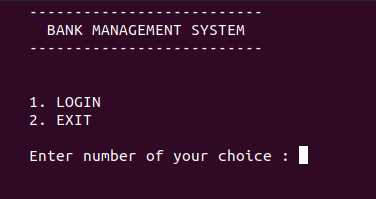

<h3 align="center">BANK MANAGEMENT SYSTEM</h3>

---

<div align="center">

[](https://github.com/harshraj8843/bank-management-system)

 

</div>

---

## 📝 Table of Contents

- [About](#about)
- [Getting Started](#getting_started)
- [Screenshots](#screenshots)

## 🧐 About <a name = "about"></a>

A Bank Management System in C++

## 🏁 Getting Started <a name = "getting_started"></a>

- clone project
  ```
  git clone https://github.com/harshraj8843/bank-management-system
  ```
  ```
  cd bank-management-system/
  ```
- compile
  ```
  g++ -o bank bank.cpp
  ```
- run
  ```
  ./bank
  ```

---

**NOTE :-** This programme is tested on `Ubuntu 20.04`

---

## Screenshots <a name = "screenshots"></a>

- LOGIN

<p align="center">

</p>

<p align="center">

</p>

- Admin

<p align="center">

</p>

<p align="center">

</p>

<p align="center">

</p>

<p align="center">

</p>

<p align="center">

</p>

<p align="center">

</p>

<p align="center">

</p>

- Staff

<p align="center">

</p>

<p align="center">

</p>

<p align="center">

</p>

- Customer

<p align="center">

</p>

---

Dev Period :- `May 2020`

---

<p align="center">
Thanks :)
</p>
